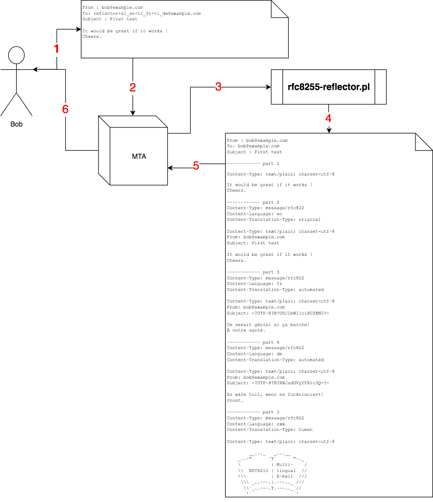

# RFC8255 (Multiple Language Content Type) mail reflector
Aims of the reflector :
* receive text/plain mail with a source language
* translate text/plain from source language to chosen destination language(s) (one or more destination)
* build a multipart/multilingual (RFC8255) with original mail and translated parts
* reply to the original sender with the multipart/multilingual mail



# How to install
One can use the rfc8255-reflector.pl on a Unix server with MTA able to pipe incoming message to a script.

Here is an example of installation on a Linux (Debian) server with Postfix :

```
$ useradd -m -s /bin/false reflector
$ cd /home/reflector
$ mkdir bin
$ curl https://raw.githubusercontent.com/igit/rfc8255-reflector/master/rfc8255-reflector.pl -o bin/rfc8255-reflector.pl
$ chmod 755 bin/rfc8255-reflector.pl
$ echo "|/home/reflector/bin/rfc8255-reflector.pl" > .forward
$ chown -R reflector:`id -g reflector` .forward bin
```
